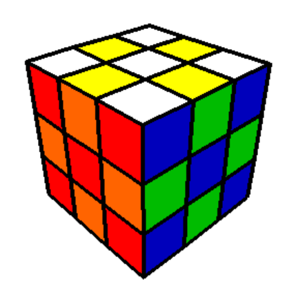

# Cube Solver

*A Rubik's Cube solver with real-time 3D visualisation, webcam-based colour
capture, and an implementation of Kociemba's two-phase algorithm. All from scratch -
written in Python.*



## What this is

`cube-solver` is a desktop application that lets you manipulate a virtual
Rubik's Cube, scramble it, capture a physical cube's colours using a webcam, and
watch it solve itself move-by-move. The project only uses `numpy` for vector / matrix maths, 
`pygame` for the window and drawing lines, and `opencv-python` for webcam capture.
Everything else is implemented from first principles. That includes: a 3D engine for drawing
the cube, K-means grouping of sampled colours from cube capture, the representation of the cube's state
and solution generation (Kociemba's algorithm).  

## What it does

The package in `cube_solver/` is organised into a few distinct layers, each
with its own file.

- **Cube representation** (`cube.py`) - three interchangeable
  representations of a cube state, each with different purposes:
  - `CubieCube` - the structurally 'true' model: which piece sits in each of the 8 corner
    and 12 edge positions, and how each piece is twisted/flipped relative to
    a reference orientation.
  - `FaceletCube` - a flat string of 54 facelet colours (the representation
    a human - or a webcam - actually sees).
  - `CoordCube` - the cube reduced to six small integers (corner
    orientation, edge orientation, UD-slice permutation, and - for phase
    two - eight-edge permutation, four-edge permutation, corner
    permutation). This makes turns an O(1) lookup.
- **Move & pruning tables** (`data.py`, `move_table_generator.py`,
  `pruning_table_generator.py`) - the static data the solver depends on:
  - `data.py` holds the raw permutation/orientation deltas for each of the 6
    face turns, plus facelet↔piece index mappings and colour tables.
  - `move_table_generator.py` builds, for every possible value of each
    `CoordCube` coordinate, the resulting coordinate after each of the 18
    moves (sizes: 2187, 2048, 495, 40320, 40320, 24 entries).
  - `pruning_table_generator.py` runs a breadth-first search outward from
    the solved state to compute, for every reachable pair of coordinates,
    the minimum number of moves needed to reach it. This is an admissible
    heuristic for the IDA* search below. Each of the four tables is
    generated in its own process (`multiprocessing`).
  - Both generators skip any table that already exists on disk, so
    generation only happens once per machine.
- **Solver** (`solver.py`) - Herbert Kociemba's two-phase algorithm (see https://kociemba.org):
  1. **Phase 1 (`g1Solver`)** searches (using all 18 moves) for a sequence
     that puts the cube into the 'G1' subgroup - corners and edges
     correctly oriented, and the four UD-slice edges in the middle
     layer.
  2. **Phase 2 (`g2Solver`)** searches (using only moves that preserve G1 -
     quarter turns of U/D and half turns of everything else) from there to
     fully solved.

  Both phases are IDA* (iterative-deepening A*) over `CoordCube` states,
  implemented iteratively with an explicit stack rather than recursion, and
  pruned using the tables above plus a canonical move ordering (no two
  consecutive turns of the same face; opposite-face pairs, which commute,
  are only tried in one order). Rather than stopping at the first G1
  solution found, `solve_cube` tries several increasingly long G1 candidates
  within a time budget, running phase 2 on each, and keeps the shortest
  *combined* solution - a short phase 1 doesn't always lead to the shortest
  overall solve.
- **Rendering & animation** (`engine.py`, `screen.py`) - a small
  3D pipeline separate from the solving logic:
  - `Cube3D` builds the 54 coloured facelets as 3D rectangles, generated
    once as a single face and copied/rotated into the other five.
  - `Transformer` builds combined X/Y/Z rotation matrices (used for both
    view rotation and face-turn animation) and `Projector` applies a
    perspective projection matrix and divide to get 2D screen coordinates.
  - `CubeManager` drives it all per frame: advances face-turn/view-rotation
    animations (eased with a sine interpolation), transforms every facelet,
    discards back-facing ones via a normal/view-direction dot product,
    depth-sorts the rest back-to-front and hands the result to `Renderer`.
  - `Renderer` (`screen.py`) owns the actual `pygame` window: drawing
    polygons, hit-testing clicks against the last-drawn facelet
    quadrilaterals (via an area-based point-in-quadrilateral test), and
    debounced/latched `Button` widgets.
- **Webcam capture** (`capture.py`) - lets a physical cube be scanned face
  by face: an alignment-grid overlay is drawn over the webcam feed with
  `opencv-python`, the average colour under each of the 9 grid cells is
  sampled for each captured face, and all 54 sampled colours are then
  clustered into 6 groups of 9 by nearest-neighbour distance (greedily
  starting from the tightest-looking cluster each time). Clusters are mapped to colours via each face's
  known centre facelet, re-oriented to match the internal facelet layout,
  and validated (correct colour counts, a legal piece assignment, and
  solvability) before being handed to the rest of the app.
- **Application shell** (`app.py`) - the `pygame` event loop tying
  everything above together: button/keyboard input, manual face turns,
  scrambling, triggering a solve or a capture, and stepping through a found
  solution one move at a time (re-orienting the view first if the next
  move would otherwise be an awkward face-pair transition).

## Project background

This project was originally written as my A-Level Computer Science NEA
(non-exam assessment) project, and was awarded **72/75**. Since submission
it's been tidied up, spell-checked and lightly refactored (see the commit
history) with the help of an agentic coding tool, but the design and
algorithms - the cube representation, the two-phase solver, the 3D renderer,
and the webcam capture pipeline - are all original work from that project.

## Running it

Requires Python 3.10+.

```
pip install -r requirements.txt
python run.py
```

On first run, move and pruning tables are generated and cached to
`tables/` (a few seconds to a couple of minutes depending on your machine);
subsequent runs load the cached JSON instead.


## Controls

```
Click the cube's faces to perform turns.
Use arrow keys to change cube view.
Press 'Space' or 'Solve' to solve the cube.
Press 'Tab' or 'Capture' to load a cube from webcam.
Press 'n' or 'Reset' to reset the cube.
Press 'Escape' to quit the application.
Press 'I' to bring up the instructions again.
```

While a solve is being demonstrated, use the on-screen **replay**/**skip**
buttons to step back/forward a move, and **pause/play** to hold the current
step.